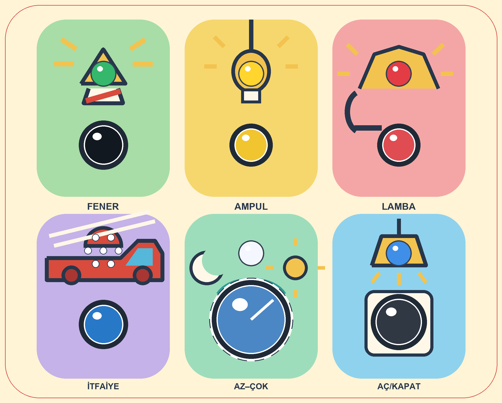
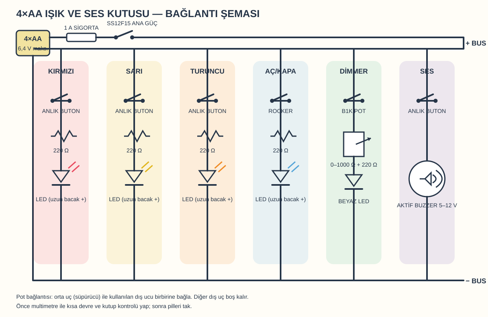

# Minik Keşif Kutusu

Elektronik kart veya yazılım kullanmadan hazırlanan, ışık–renk–ses ilişkisini
öğreten bir etkinlik kutusu. Kutu 200 × 160 × 52 mm'dir; geçmeli arka kapağı
vardır ve seri bağlanan iki adet 2×AA pil yuvasıyla çalışır.



> [!WARNING]
> Bu proje sertifikalı bir oyuncak değildir. 18 aylık çocuk yalnızca bir
> yetişkinin doğrudan gözetiminde kullanmalıdır. Her kullanımdan önce kapağı,
> anahtarları, LED'leri ve çarkı çekerek gevşeklik kontrolü yapın.

## Ne öğretiyor?

| Bölüm | Çocuğun yaptığı | Sonuç |
|---|---|---|
| Lamba | Kırmızı DC184'e basar | Kırmızı LED yanar |
| Ampul | Sarı DC184'e basar | Sarı LED yanar |
| Fener | Siyah DC180'e basar | Yeşil LED yanar |
| Aç/kapat | DC131A'yı değiştirir | Mavi LED açık kalır veya söner |
| Az–çok | 1K pot çarkını çevirir | Beyaz LED'in parlaklığı değişir |
| İtfaiye | Mavi DC180'e basar | 12 mm aktif buzzer çalar |

Elektronik bağlantıların tamamı basit paralel kollardan oluşur. Breadboard,
mikrodenetleyici veya özel elektronik kart gerekmez.

## Yapım sırası

### 1. Malzemeleri hazırlayın

Temel parçalar:

| Adet | Parça | Kullanıldığı yer |
|---:|---|---|
| 2 | 2×AA yarı kapalı pil yuvası | Arka kapaktaki iki ray |
| 4 | AA alkalin pil | İki yuvada, seri bağlantı |
| 2 | DC184 anlık buton: kırmızı ve sarı | Lamba ve ampul |
| 2 | DC180 anlık buton: siyah ve mavi | Fener ve buzzer |
| 1 | DC131A 20 mm aç/kapat anahtar | Mavi LED |
| 1 | DC120 2P aç/kapat anahtar | Kutunun sağ yanında ana güç |
| 1 | 1K potansiyometre | Parlaklık çarkı |
| 5 | 10 mm LED: kırmızı, sarı, yeşil, mavi, beyaz | Ön panel |
| 5 | 330 Ω / 1 W direnç | Her LED için ayrı bir tane |
| 1 | 12 mm aktif buzzer, 5–12 V | İtfaiye bölümü |
| 1 | 1 A sigorta ve kapalı yuvası | Pil artı hattı |
| — | Çok telli kablo, makaron, nötr kürlenen silikon | Güvenli montaj |
| — | PETG filament | Gövde, kapak ve çark |

Ayrıntılı ve yazdırılabilir liste: [docs/BOM.csv](docs/BOM.csv).

### 2. Önce test parçalarını basın

OpenSCAD kurulu bir bilgisayarda:

```sh
make stl
```

Önce yalnızca şu iki dosyayı yazdırın:

- `output/stl/component-fit-test.stl`: satın alınan komponentlerin delik ve mil
  toleranslarını dener.
- `output/stl/snap-fit-test.stl`: vidasız kapak tırnağını dener.


Komponent kuponunun üst sırasında soldan sağa LED, DC184, DC180, DC131A ve
buzzer; alt sırasında pot burcu, üç pot mili yuvası, iki DC120 kesiti ve çark
açıklığı bulunur. Her grupta soldaki seçenek daha sıkıdır. Parça zorlanmadan
girmeli, fakat çekildiğinde çıkmamalıdır.

Varsayılan ana model ölçüleri:

| Parça | Kesit |
|---|---:|
| 10 mm LED | Ø10,2 mm |
| DC184 | Ø12,0 mm |
| DC180 | Ø16,0 mm |
| DC131A | Ø20,2 mm |
| DC120 | 19,0 × 13,0 mm |
| Pot burcu / mil | Ø7,0 / Ø6,2 mm |

Farklı ölçü daha iyi oturursa [tools/project_spec.py](tools/project_spec.py)
içindeki ilgili değeri değiştirip `make dimensions` çalıştırın.

### 3. Ana parçaları basın

`make stl` şu parçaları `output/stl/` altında üretir:

- `activity-box-body.stl` — gövde
- `activity-box-back.stl` — geçmeli arka kapak ve çift pil bölmesi
- `activity-box-dial.stl` — çocuk tarafından çıkarılamayan dimmer çarkı

Öneri: PETG, 0,20 mm katman, en az dört duvar, beş alt/üst katman ve yüzde 25
dolgu. Gövdeyi ön yüzü, kapağı dış yüzü, çarkı geniş flanşı tabla üzerinde
olacak şekilde basın. Baskı ayrıntıları için
[montaj kılavuzuna](docs/assembly.md) bakın.

### 4. Etiketi hazırlayın

[A4 etiket PDF'sini](artwork/activity-box-label-a4.pdf) yüzde 100 / gerçek
boyutta ve “sayfaya sığdır” kapalıyken yapışkanlı kâğıda basın. Sayfadaki
kontrol karesi tam 20 mm olmalıdır. Normal beyaz yapışkanlı kâğıtta yazıcı
ayarındaki “ayna/transfer” seçeneği kapalı olmalıdır; baskılı yüz dışa bakar.

1. Kırmızı dış kesim çizgisinden etiketi kesin.
2. Beyaz komponent boşluklarını çıkarın.
3. Gövde ön yüzünü temizleyin.
4. Etiketi, komponentler takılmadan önce deliklere hizalayıp yapıştırın.

Vektör kaynak dosyası: [artwork/activity-box-label.svg](artwork/activity-box-label.svg).

### 5. Bileşenleri yerleştirin


Ön yüzden bakıldığında yerleşim şöyledir:

| Konum | Üst parça | Alt kumanda | Sabitleme |
|---|---|---|---|
| Sol üst | Yeşil 10 mm LED | Siyah DC180 | LED iç taraftan; buton somunla |
| Orta üst | Sarı 10 mm LED | Sarı DC184 | LED iç taraftan; buton somunla |
| Sağ üst | Kırmızı 10 mm LED | Kırmızı DC184 | LED iç taraftan; buton somunla |
| Sol alt | 12 mm aktif buzzer | Mavi DC180 | Buzzer baskı kabına, buton somunla |
| Orta alt | Beyaz 10 mm LED | Baskı çarkı + 1K pot | Pot iç köprüye somunla |
| Sağ alt | Mavi 10 mm LED | DC131A | İkisi de iç taraftan, somunla |
| Sağ yan yüz | — | DC120 2P | Kendi tırnaklarıyla |
| Arka kapak | — | İki 2×AA yuva | Ayrı raylara; gerekirse ince köpük bantla |

LED'leri kutunun içinden dışarı itin: geniş LED flanşı içeride kalmalıdır.
Arkadaki açık koruma halkasına az miktarda nötr kürlenen silikon sürülebilir;
lensin önüne silikon sürmeyin. Buzzer'ı yalnızca kenarından sabitleyin, ses
deliklerini kapatmayın. Anahtar, buton ve potta silikon yerine somun/tırnak
kullanın.

### 6. Devreyi bağlayın



Piller takılı değilken güç hattını şu sırayla kurun:

```text
Yuva A siyah ─────────────────────────────────────── eksi dağıtım hattı
Yuva A kırmızı ── Yuva B siyah
Yuva B kırmızı ── 1 A sigorta ── DC120 ─────────── artı dağıtım hattı
```

Altı işlevi artı ve eksi dağıtım hatları arasına paralel bağlayın:

```text
Artı → kırmızı DC184 → 330 Ω → kırmızı LED → eksi
Artı → sarı DC184    → 330 Ω → sarı LED    → eksi
Artı → siyah DC180   → 330 Ω → yeşil LED   → eksi
Artı → DC131A kontak → 330 Ω → mavi LED    → eksi
Artı → 1K pot        → 330 Ω → beyaz LED   → eksi
Artı → mavi DC180            → aktif buzzer → eksi
```

DC131A'nın 12 V lamba terminalini bağlamayın; yalnızca multimetreyle tespit
ettiğiniz iki anahtar kontağını kullanın. LED'de uzun bacak artıdır. Potun orta
ucunu kullanılan dış uçla birleştirin; diğer dış uç boş kalır. Tüm bağlantıları
lehimleyip makaronla yalıtın. Ayrıntılar: [docs/circuit.svg](docs/circuit.svg)
ve [docs/assembly.md](docs/assembly.md).

### 7. Test edin ve kapatın

1. Piller yokken artı–eksi arasında kısa devre olmadığını ölçün.
2. DC120 kapalıyken pil akımının sıfır olduğunu doğrulayın.
3. Her LED kolunu ayrı deneyin; akım 20 mA altında kalmalıdır.
4. Buzzer'ı kısa süre deneyip ses seviyesini kontrol edin.
5. Kabloları klipslere alın; breadboard veya gevşek jumper bırakmayın.
6. Pil yuvalarını raylarına yerleştirip arka kapağı dört tırnak oturana kadar
   bastırın.
7. Tüm dış parçaları kuvvetlice çekerek son güvenlik kontrolünü yapın.

## Proje dosyaları

| Klasör | İçerik |
|---|---|
| [cad](cad/activity_box.scad) | Parametrik OpenSCAD modeli |
| [artwork](artwork/activity-box-label-preview.png) | Etiket, baskı PDF'si ve ön izlemeler |
| [docs](docs/assembly.md) | Montaj kılavuzu, test plakası kılavuzu, devre şeması ve BOM |
| [tools](tools/project_spec.py) | Ölçülerin tek kaynağı ve çıktı üreticileri |
| [tests](tests/test_project_spec.py) | Geometri, görsel, belge ve doğrulama testleri |
| [output/stl](output/stl/README.md) | Yerel olarak oluşturulan STL dosyalarının hedefi |

## Çıktıları yeniden üretme

Görsel üretmek için Python 3 ve Pillow gerekir. OpenSCAD yalnızca STL üretimi
için gereklidir.

```sh
python3 -m pip install Pillow
make dimensions artwork docs
python3 -m unittest discover -s tests -v
make stl
make validate
```

Ana kesit ölçüleri mevcut komponentler ve yazıcıyla test kuponunda doğrulandı.
Yazıcı, filament veya komponent partisi değişirse test kuponunu yeniden basın.
