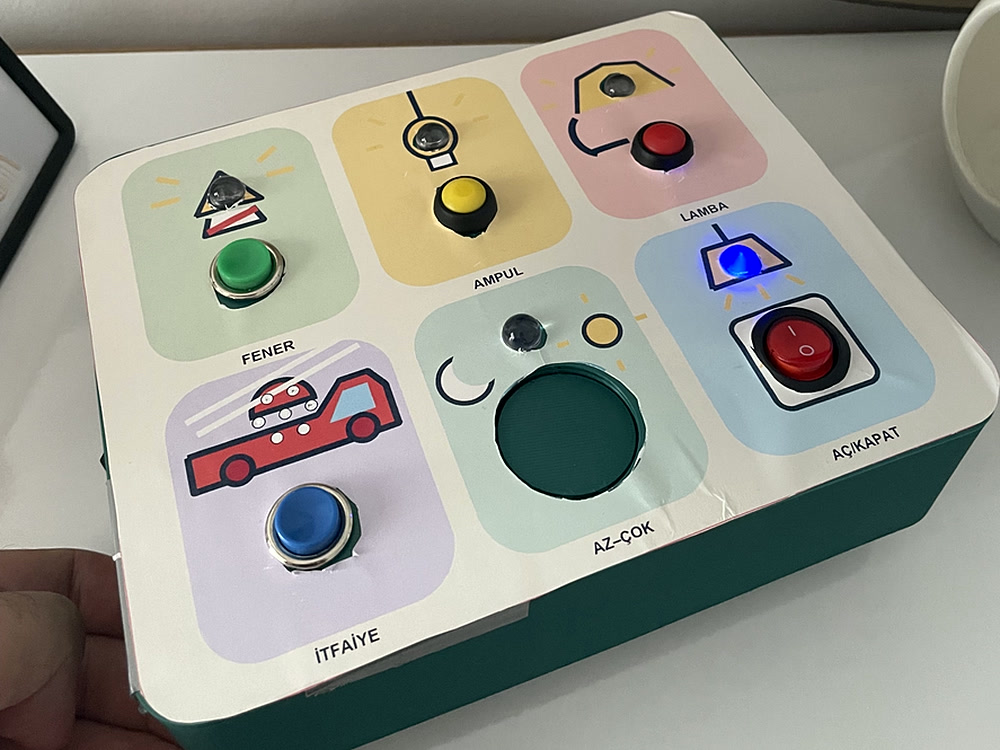
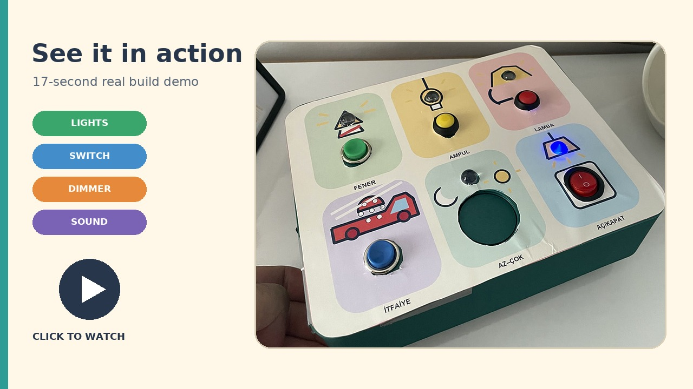
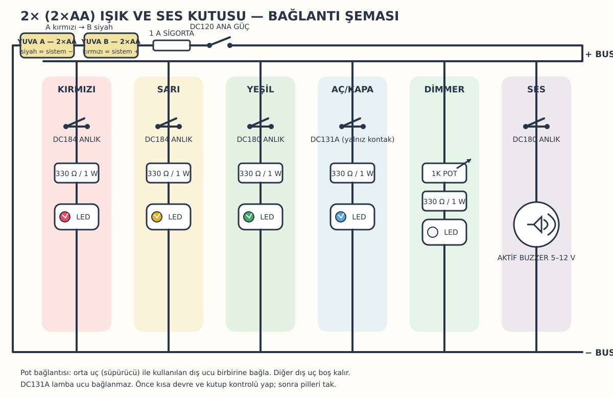

# Minik Keşif Etkinlik Kutusu

[English](README.md) | [Türkçe](README.tr.md)

Işık, anahtar, parlaklık ve ses yoluyla neden–sonuç ilişkisini öğreten;
yazılım, mikrodenetleyici ve özel elektronik kart gerektirmeyen bir etkinlik
kutusu. Parametrik gövde standart bir 3B yazıcıda basılır ve vidasız servis
tırnaklarıyla kapanır.



> [!WARNING]
> Bu topluluk donanım projesi sertifikalı bir oyuncak değildir. 18 aylık çocuk
> yalnızca bir yetişkinin doğrudan gözetiminde kullanmalıdır. Her kullanımdan
> önce dış parçaları ve arka kapağı çekerek kontrol edin. Kırık, gevşek, akan
> veya ısınan bir parça varsa pilleri hemen çıkarın.

## Çalışırken görün

[](media/activity-box-demo.mp4)

▶ **[17 saniyelik gerçek yapım videosunu izleyin](media/activity-box-demo.mp4).**
Videoda butonla çalışan ışıklar, kalıcı aç/kapat anahtarı, dimmer ve ses
kumandası tamamlanmış kutu üzerinde gösterilir.

## Çocuk neyi keşfeder?

| Etkinlik | Kumanda | Sonuç |
|---|---|---|
| Lamba | Kırmızı DC184 | Kırmızı LED yanar |
| Ampul | Sarı DC184 | Sarı LED yanar |
| Fener | Siyah DC180 | Yeşil LED yanar |
| Aç/kapat | DC131A | Mavi LED açık kalır veya söner |
| Az–çok | 1K pot çarkı | Beyaz LED'in parlaklığı değişir |
| İtfaiye | Mavi DC180 | Aktif buzzer çalar |

Altı işlev basit paralel kollardan oluşur. Mikrodenetleyici, breadboard,
yazılım veya özel PCB gerekmez.

## Yapım sırası

### 1. Malzemeleri hazırlayın

| Adet | Parça | Kullanım |
|---:|---|---|
| 2 | Yarı kapalı 2×AA pil yuvası | Dört AA pili seri bağlamak için |
| 4 | AA alkalin pil | Nominal 6 V besleme |
| 2 | Kırmızı ve sarı DC184 anlık buton | Kırmızı/sarı LED kolları |
| 2 | Siyah ve mavi DC180 anlık buton | Yeşil LED ve buzzer |
| 1 | DC131A 20 mm aç/kapat anahtar | Mavi LED kolu |
| 1 | DC120 2P aç/kapat anahtar | Ana güç |
| 1 | 1K potansiyometre | Beyaz LED dimmeri |
| 5 | Kırmızı, sarı, yeşil, mavi ve beyaz 10 mm LED | Işık çıkışları |
| 5 | 330 Ω / 1 W direnç | Her LED'e bir tane |
| 1 | 12 mm aktif buzzer, 5–12 V | Ses çıkışı |
| 1 | Kapalı yuvalı 1 A sigorta | Pil kısa devre koruması |
| — | Çok telli kablo, makaron, nötr kürlenen silikon | Güvenli montaj |
| — | PETG filament | Gövde, arka kapak ve çark |

Ayrıntılar için [malzeme listesini](docs/tr/BOM.csv) kullanın.

### 2. Önce test parçalarını basın

```sh
make stl
```

Tam gövdeden önce şunları basın:

- `output/stl/component-fit-test.stl`: komponent geçmelerini kontrol eder.
- `output/stl/snap-fit-test.stl`: vidasız kapak tırnaklarını kontrol eder.


Varsayılan kesitler: LED Ø10,2 mm, DC184 Ø12,0 mm, DC180 Ø16,0 mm,
DC131A Ø20,2 mm, DC120 19,0×13,0 mm, pot burcu/mili Ø7,0/Ø6,2 mm ve
Ø34 mm çark açıklığıdır. Daha iyi bir geçme bulursanız
[`tools/project_spec.py`](tools/project_spec.py) değerini değiştirip
`make dimensions` çalıştırın.

### 3. Ana parçaları basın

`make stl` şu dosyaları üretir:

- `activity-box-body.stl`
- `activity-box-back.stl`
- `activity-box-dial.stl`
- `snap-fit-test.stl`
- `component-fit-test.stl`

Önerilen ayarlar: PETG, 0,20 mm katman, en az dört duvar, beş alt/üst katman
ve yüzde 25 dolgu. Hapsolmuş çark, Ø34 mm panel açıklığının içinde kalan
Ø36 mm × 4 mm flanş kullanır.

### 4. Etiketi hazırlayın

[A4 etiketi](artwork/tr/activity-box-label-a4.pdf) **gerçek boyut / yüzde 100**
ile basın; sayfaya sığdırma ve ayna/transfer kapalı olsun. Kontrol karesi tam
20 mm olmalıdır. Etiketi komponentlerden önce yapıştırın.

Düzenlenebilir kaynak: [activity-box-label.svg](artwork/tr/activity-box-label.svg).

### 5. Bileşenleri yerleştirin


LED'leri içeriden yerleştirerek geniş flanşlarını kutu içinde bırakın. Ana
tutucu olarak komponent somunlarını veya kendi tırnaklarını kullanın. Nötr
kürlenen silikon LED'lerde yalnız titreşim desteği olabilir. Buzzer'ın ses
deliklerini kapatmayın.

Tüm ayrıntılar [montaj kılavuzundadır](docs/tr/assembly.md).

### 6. Devreyi bağlayın



Piller takılı değilken besleme hattını kurun:

```text
Yuva A siyah ───────────────────────────────────── eksi hat
Yuva A kırmızı ─── Yuva B siyah
Yuva B kırmızı ─── 1 A sigorta ─── DC120 ─────── artı hat
```

Altı kolu paralel bağlayın:

```text
Artı → kırmızı DC184 → 330 Ω → kırmızı LED → eksi
Artı → sarı DC184    → 330 Ω → sarı LED    → eksi
Artı → siyah DC180   → 330 Ω → yeşil LED   → eksi
Artı → DC131A        → 330 Ω → mavi LED    → eksi
Artı → 1K pot        → 330 Ω → beyaz LED   → eksi
Artı → mavi DC180            → aktif buzzer → eksi
```

DC131A'nın yalnız iki anahtar kontağını kullanın; 12 V lamba ucunu boş bırakın.
Pin dizilimini varsaymak yerine kontakları multimetreyle bulun. Potun orta ucunu
kullanılan dış uçla birleştirin.

### 7. Test edin ve kapatın

1. Piller yokken artı–eksi arasında kısa devre olmadığını ölçün.
2. DC120 kapalıyken pil akımının sıfır olduğunu doğrulayın.
3. Kolları ayrı deneyin; her LED 20 mA altında kalmalıdır.
4. Yalıtılmış kabloları kapak tırnaklarından uzak tutun.
5. Arka kapağın dört tırnağını da oturtun.
6. Her kullanımdan önce tüm dış parçaları ve arka kapağı çekerek kontrol edin.

## Repo yapısı

| Yol | İçerik |
|---|---|
| [`cad/`](cad/activity_box.scad) | Parametrik OpenSCAD modeli |
| [`artwork/`](artwork/activity-box-label.svg) | İngilizce etiket ve ön izlemeler |
| [`artwork/tr/`](artwork/tr/activity-box-label.svg) | Türkçe etiket ve ön izlemeler |
| [`docs/`](docs/assembly.md) | İngilizce montaj, BOM, devre ve yerleşim kılavuzları |
| [`docs/tr/`](docs/tr/assembly.md) | Türkçe belge paketi |
| [`media/`](media/activity-box-hero.jpg) | Gerçek yapım fotoğrafı, videosu ve video kapağı |
| [`assets/fonts/`](assets/fonts/LICENSE.txt) | Tekrarlanabilir görseller için paketlenmiş font ve kaynak lisansı |
| [`tools/`](tools/project_spec.py) | Ortak ölçüler ve çıktı üreticileri |
| [`tests/`](tests/test_project_spec.py) | Geometri, çıktı ve belge kontrolleri |

## Yeniden üretme ve doğrulama

Python 3 ve Pillow belge/görselleri üretir. OpenSCAD yalnız STL için gerekir.

```sh
python3 -m pip install -r requirements.txt
make dimensions artwork docs
make test
make stl
make validate
```

Değişiklik önermeden önce [katkı kılavuzunu](CONTRIBUTING.tr.md) okuyun.

## Lisans

Donanım, CAD, görsel ve belgeler [CERN-OHL-P-2.0](LICENSE); üretim scriptleri
ve testler [MIT Lisansı](LICENSES/MIT.txt) altındadır. Ayrıntılı kapsam için
[lisans açıklamasına](LICENSES/README.tr.md) bakın.
