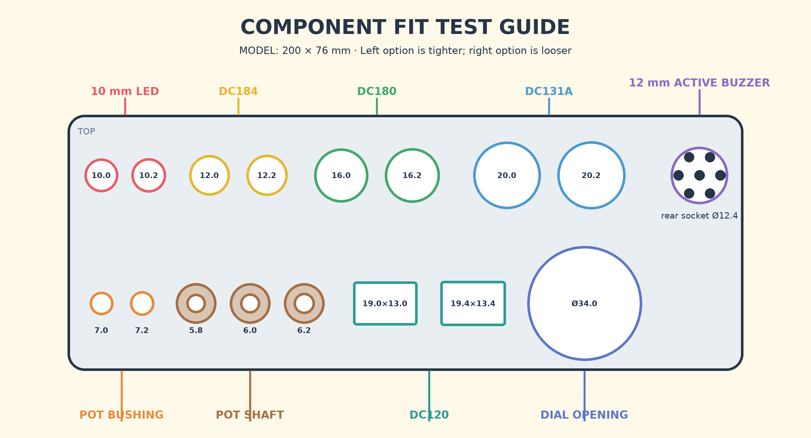
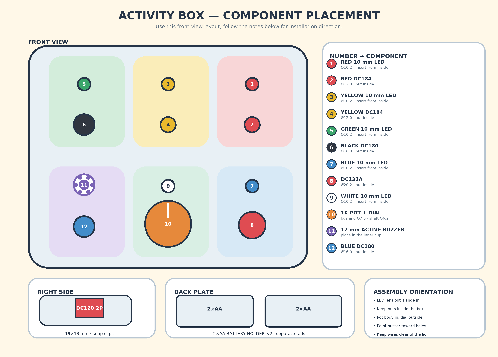

# Assembly and verification guide

## Important safety notice

This community hardware project is not a certified toy. A child aged 18
months must use it only under direct adult supervision. Remove the batteries
immediately if any part cracks, loosens, or becomes warm. Do not use lithium
batteries. A screwless enclosure still requires regular pull testing of the
back plate and every exposed component.

## 1. Verified fit dimensions

The component coupon confirmed 10.2 mm for 10 mm LEDs, 12.0 mm for DC184,
16.0 mm for DC180, and 20.2 mm for DC131A. The selected potentiometer sizes
are a 7.0 mm bushing hole and a 6.2 mm shaft socket. The DC120 cutout is
19.0×13.0 mm. The buzzer cup was tested and the dial opening remains 34 mm.
Print the coupon again whenever the printer, filament, or component batch
changes, then update `tools/project_spec.py` if needed.

## 2. Print the component coupon first

With `component-fit-test.stl` horizontal, read the openings from left to right:

- Top row: LED 10.0 / 10.2; DC184 12.0 / 12.2; DC180 16.0 / 16.2;
  DC131A 20.0 / 20.2; 12 mm buzzer cup at the far right.
- Bottom row: pot bushing 7.0 / 7.2; shaft socket 5.8 / 6.0 / 6.2;
  DC120 19.0×13.0 / 19.4×13.4; 34 mm dial opening.

The part should enter without force while its nut or clips seat fully. It must
not pull out by hand. Transfer the best dimension to `tools/project_spec.py`
before regenerating the body. The shared bay for two 2×AA holders measures
62×68×18 mm and must also be checked against the purchased parts.

Print `snap-fit-test.stl` next. The tab should engage easily but resist opening
with one hand. Increase `clearance` by 0.10 mm if too tight or reduce it by
0.10 mm if loose. Recommended print settings: PETG, 0.20 mm layers, at least
four walls, five top/bottom layers, and 25% infill. Reject parts with sharp
burrs, layer separation, or cracked clips.

## 3. Apply the label

Print `artwork/activity-box-label-a4.pdf` at **actual size / 100%** with
“fit to page” disabled. Verify that the control square measures exactly 20 mm.
For ordinary white adhesive paper, keep mirror/transfer printing disabled; the
printed face points outward. Cut on the red trim line and have an adult remove
the component openings. Degrease the panel, align the label to the holes, and
apply it from the center outward.

## 4. Install front-panel components

Insert each 10 mm LED from inside the enclosure. The lens passes through the
10.2 mm hole while the wider flange remains inside as the mechanical retainer.
Apply a small amount of neutral-cure silicone around the printed guard for
vibration support only. Keep silicone away from the lens. The long lead is
positive; the short lead or flat edge is negative.

Secure the red and yellow DC184 buttons and the black and blue DC180 buttons
with their nuts. Fit the DC131A in the 20.2 mm opening. Insert the dial from
inside the 34 mm opening; its 36 mm diameter, 4 mm thick flange remains captive
and clears the LED guard. Fasten the 1K pot to the printed bridge, using the
shaft socket selected with the coupon. Place the buzzer in its cup with its
opening toward the sound holes and retain it only around the edge.

## 5. Wire the battery holders and main power

With all batteries removed, connect the holders in series:

1. Holder A black wire → system negative bus.
2. Holder A red wire → Holder B black wire; solder and fully cover the joint
   with heat-shrink tubing.
3. Holder B red wire → 1 A fuse → DC120 2P main switch → system positive bus.

This produces four AA cells in series: 6 V nominal and approximately 6.4 V
with fresh alkaline cells. Use matching cells of the same brand, chemistry,
and state of charge in both holders.

## 6. Wire the six parallel branches

1. Positive → red DC184 → 330 ohm 1 W → red LED long lead; short lead → negative.
2. Positive → yellow DC184 → 330 ohm 1 W → yellow LED → negative.
3. Positive → black DC180 → 330 ohm 1 W → green LED → negative.
4. Positive → DC131A switch contacts → 330 ohm 1 W → blue LED → negative.
   Leave the DC131A 12 V lamp terminal disconnected. Do not assume pin order;
   identify the two switch contacts with a multimeter in continuity mode.
5. Positive → joined pot wiper and one outer terminal → 330 ohm 1 W → white
   LED → negative. Leave the other outer pot terminal disconnected.
6. Positive → blue DC180 → active buzzer positive; buzzer negative → negative.

Resistors have no polarity, and every LED requires its own 330 ohm resistor.
The 1 W resistor is electrically suitable but physically larger than a 0.25 W
part. Do not leave breadboards or loose jumper wires in the finished product.
Use stranded wire, solder every joint, and cover all exposed conductors with
heat-shrink tubing.

## 7. Electrical verification

With batteries removed, use a multimeter to verify there is no short between
the positive and negative buses. Battery current must be zero when DC120 is
off. With fresh cells, theoretical maximum LED currents are approximately
13.3 mA red, 13.0 mA yellow, and 10.3 mA green/blue/white. Test one branch at a
time and confirm each measured LED current stays below 20 mA. Sound the buzzer
for only a few seconds; if it is too loud, place thin felt in front without
blocking every sound hole.

## 8. Close and inspect the enclosure

Place the two battery holders in their separate rear rails and keep wires away
from all clips. Press the back plate tongue squarely into the body groove until
all four clips engage. The back must not open by hand unless both opposing
service latches are pressed at the same time with two thin tools. Pull-test
every button, LED, switch, and the dial before each use. Do not give the box to
the child if any part moves, cracks, or loosens.
