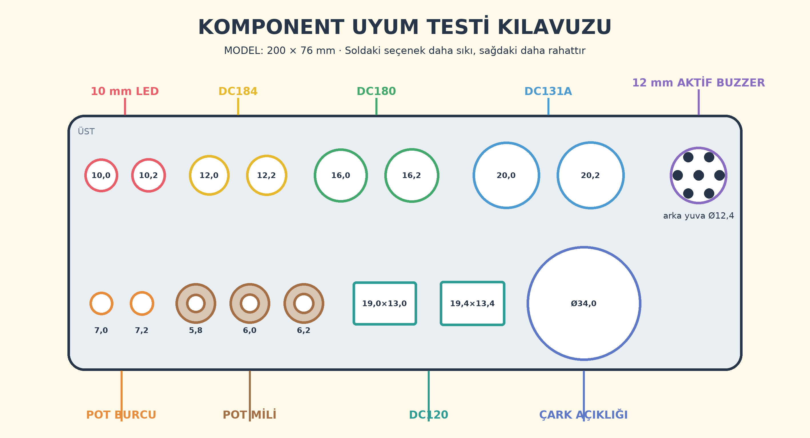
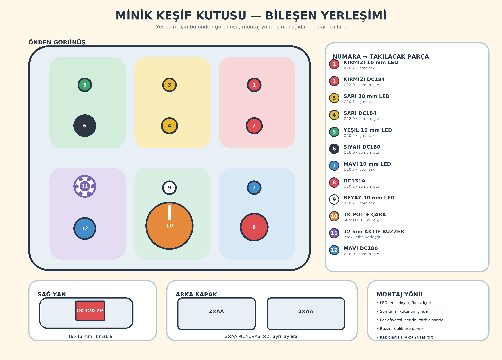

# Montaj ve kontrol kılavuzu

## Önemli güvenlik notu

Bu topluluk donanım projesi sertifikalı bir oyuncak değildir. 18 aylık çocuk
yalnızca bir yetişkinin doğrudan gözetiminde kullanmalıdır. Kırılan, çatlayan,
gevşeyen veya ısınan bir parça görülürse pilleri hemen çıkarın. Lityum pil
kullanmayın. Vida kullanılmaması, kapağın ve dış parçaların düzenli çekme
kontrolü gereğini ortadan kaldırmaz.

## 1. Doğrulanan geçme ölçüleri

Komponent kuponunda 10 mm LED için 10,2 mm, DC184 için 12,0 mm, DC180 için
16,0 mm ve DC131A için 20,2 mm doğrulandı. Pot burcu 7,0 mm, pot mili 6,2 mm,
DC120 kesiti 19,0×13,0 mm'dir. Buzzer kabı test edildi; çark açıklığı 34 mm'dir.
Yazıcı, filament veya komponent partisi değişirse tam gövdeden önce kuponu
yeniden basın ve gerekirse `tools/project_spec.py` değerlerini düzeltin.

## 2. Önce komponent test kuponunu basın

`component-fit-test.stl` yatay tutulduğunda delikler soldan sağa şöyledir:

- Üst sıra: LED 10,0 / 10,2; DC184 12,0 / 12,2; DC180 16,0 / 16,2;
  DC131A 20,0 / 20,2; en sağda 12 mm buzzer kabı.
- Alt sıra: pot burcu 7,0 / 7,2; mil yuvası 5,8 / 6,0 / 6,2;
  DC120 19,0×13,0 / 19,4×13,4; 34 mm çark açıklığı.

Parça zorlamadan girmeli, somun veya tırnak bütün yüzeye oturmalı ve elle
çekildiğinde çıkmamalıdır. En iyi ölçüyü `tools/project_spec.py` içine aktarıp
ana modeli yeniden üretin. İki 2×AA pil yuvasının ortak bölmesi 62×68×18 mm'dir;
bu ölçüyü de satın alınan parçalarla doğrulayın.

Ardından `snap-fit-test.stl` tolerans numunesini basın. Tırnak rahat girip tek
elle çıkmamalıdır. Çok sıkıysa `clearance` değerini 0,10 mm artırın; gevşekse
0,10 mm azaltın. Önerilen ayarlar: PETG, 0,20 mm katman, en az dört çevre, beş
alt/üst katman ve yüzde 25 dolgu. Katman ayrılması, sivri çapak veya tırnak
çatlağı olan parçayı kullanmayın.

## 3. Etiketi uygulayın

`artwork/tr/activity-box-label-a4.pdf` dosyasını **gerçek boyut / yüzde 100**
seçeneğiyle, sayfaya sığdırmayı kapatarak basın. Kontrol karesinin tam 20 mm
olduğunu ölçün. Normal beyaz yapışkanlı kâğıtta ayna/transfer seçeneği kapalı
olmalı; baskılı yüz dışa bakmalıdır. Kırmızı kesim çizgisinden kesin ve
komponent boşluklarını yalnızca bir yetişkin çıkarsın. Yüzeyi yağdan arındırın,
etiketi deliklere hizalayın ve ortadan kenarlara doğru yapıştırın.

## 4. Ön panel bileşenlerini takın

10 mm LED'leri kutunun içinden dışarı doğru yerleştirin. Lens 10,2 mm delikten
çıkar; geniş LED flanşı içeride mekanik tutucu olarak kalır. Baskı koruma
halkasına yalnız titreşim desteği için az miktarda nötr kürlenen silikon sürün.
Lense silikon sürmeyin. Uzun bacak artı, kısa bacak veya düz kenar eksidir.

Kırmızı ve sarı DC184'leri, siyah ve mavi DC180'leri somunlarıyla sabitleyin.
DC131A'yı 20,2 mm deliğe takın. Çarkı 34 mm açıklığa içeriden yerleştirin;
Ø36 mm ve 4 mm kalınlığındaki flanşı içeride hapsolur ve LED yuvasına çarpmaz.
1K potu baskı köprüsüne somunlayın ve kuponda seçilen mil yuvasını kullanın.
Buzzer'ı açık yüzü ses deliklerine bakacak şekilde kaba yerleştirip yalnızca
kenarından sabitleyin.

## 5. Pil yuvalarını ve ana gücü bağlayın

Piller takılı değilken iki pil yuvasını seri bağlayın:

1. Yuva A siyah kablo → sistem eksi dağıtım hattı.
2. Yuva A kırmızı kablo → Yuva B siyah kablo; ek yerini lehimleyip makaronla
   tamamen kapatın.
3. Yuva B kırmızı kablo → 1 A sigorta → DC120 2P ana güç anahtarı → sistem
   artı dağıtım hattı.

Bu bağlantı dört AA pili seri yapar: nominal 6 V, taze alkalin pillerle yaklaşık
6,4 V. İki yuvada da aynı marka, tip ve dolulukta pil kullanın.

## 6. Altı paralel kolu bağlayın

1. Artı → kırmızı DC184 → 330 ohm 1 W → kırmızı LED uzun bacak; kısa bacak → eksi.
2. Artı → sarı DC184 → 330 ohm 1 W → sarı LED → eksi.
3. Artı → siyah DC180 → 330 ohm 1 W → yeşil LED → eksi.
4. Artı → DC131A anahtar kontakları → 330 ohm 1 W → mavi LED → eksi.
   DC131A'nın 12 V lamba ucunu bağlamayın. Pin dizilimini varsaymayın;
   kullanılacak iki kontağı multimetrenin süreklilik moduyla bulun.
5. Artı → birbirine bağlanan pot orta ucu ve bir dış uç → 330 ohm 1 W → beyaz
   LED → eksi. Potun diğer dış ucunu boş bırakın.
6. Artı → mavi DC180 → aktif buzzer artı; buzzer eksi → eksi.

Dirençlerin yönü yoktur; her LED kendi 330 ohm direncini kullanır. 1 W direnç
elektriksel olarak uygundur, yalnızca 0,25 W tipten daha büyüktür. Kalıcı
oyuncakta breadboard veya gevşek jumper bırakmayın. Çok telli kablo kullanın,
tüm ekleri lehimleyin ve açık iletkenleri makaronla kapatın.

## 7. Elektrik kontrolünü yapın

Piller yokken artı ve eksi arasında kısa devre olmadığını multimetreyle
doğrulayın. DC120 kapalıyken pil akımı sıfır olmalıdır. Taze pillerle teorik en
yüksek LED akımı kırmızıda yaklaşık 13,3 mA, sarıda 13,0 mA, yeşil/mavi/beyazda
10,3 mA'dır. Her kolu ayrı çalıştırın ve ölçülen akımın 20 mA altında kaldığını
doğrulayın. Buzzer'ı yalnızca birkaç saniye deneyin; fazla yüksekse ses
deliklerini tamamen kapatmadan önüne ince keçe yerleştirin.

## 8. Kutuyu kapatın ve denetleyin

İki pil yuvasını arka kapaktaki ayrı raylara yerleştirin; kablolar tırnaklardan
uzak kalsın. Kapağın dilini gövdenin yivine düz bastırıp dört tırnağı oturtun.
Karşılıklı iki servis mandalı aynı anda iki ince aletle bastırılmadan kapak elle
açılmamalıdır. Her kullanımdan önce her buton, LED, anahtar ve çarkı çekerek
kontrol edin. Bir parça hareket ediyor, çatlıyor veya gevşiyorsa kutuyu çocuğa
vermeyin.
